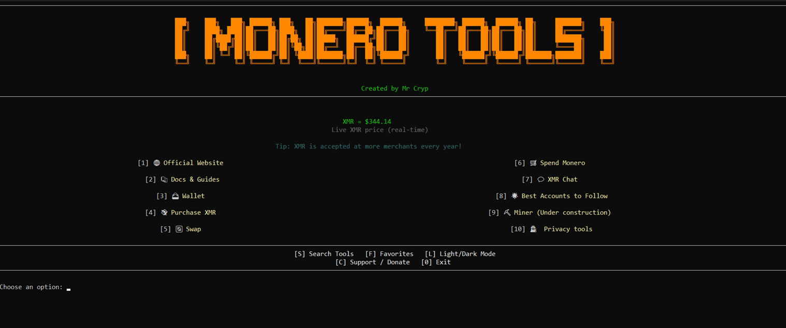

# <p align="center"> Monero Tools Menu 🛡️

<div align="center">


</div>

A curated menu for the best Monero tools: wallets, privacy resources, exchanges, communication, and more all in one CLI interface.

<div align="center"> 

 **Created by [𝕄𝕣ℂ𝕣𝕪𝕡 ㉿](https://x.com/L0rd_t0ken)**

---

## <p align="center"> 📸 Screenshot



---

## <p align="center"> 🚀 Features

- Quick access to top Monero wallets, exchanges, guides, and privacy tools
- Subcategories for browsers, secure messaging, email, passwords, VPN, 2FA, and cloud storage
- Favorites system
- Tool search by keyword
- Light/Dark mode
- Live XMR price (via CoinGecko)
- Support/Donate section

---

## <p align="center"> 🛠️ Menu Categories & Tools
<div align="center">

| Category                  |    Monero XMR                                                                                                    |
|---------------------------|---------------------------------------------------------------------------------------------------------------------------|
| Official Website          |        Docs & Guides                                                                                                   |
| Wallet             |            Purchase XMR                             |
| Swap                    |         Spend Monero                                                                                                     |
|XMR Chat              |        Best Accounts to Follow                                                                           |
| Miner tools               | _Section under construction_                                                                                              |
| Privacy tools             | **Browsers & Web**  <br> **Messaging** <br> **Email** <br> **Passwords** <br> **VPN** <br> **2FA**  <br> **Cloud**  |

---

## <p align="center"> 🧑‍💻 Installation & Usage

### 1. Clone the repository

```bash
git clone https://github.com/MrCrypPrivacy/Monero-Tools-Privacy.git
cd Monero-Tools-Privacy
```

### 2. (Recommended) Create a virtual environment

Especially on Linux/WSL, use a virtual environment to avoid permission errors:

```bash
python3 -m venv venv
source venv/bin/activate
```

### 3. Install dependencies

```bash
pip install -r requirements.txt
```

### 4. Run the tool

```bash
python monero_tools.py
```

---

## <p align="center"> 📦 Requirements

- Python 3.8 or higher
- pip

---

## <p align="center"> 🤝 Contributing

Want to add your favorite tool or suggest an improvement?
Pull requests and issues are welcome!

1. Fork the repo
2. Create a branch: `git checkout -b my-feature`
3. Make your changes and open a Pull Request

---

## <p align="center"> 📜 License

This project is licensed under the MIT License.

---

<div align="center">

## 💸 Support / Donate

If you'd like to support this project, you can donate privately:

**Monero (XMR):**  
<code>87k6ViTfSFGApzyyqr8jsuELYeBQ37yvndCWJcHgHDUf97LUz36JUutBtJiBYNBBDJeBCPN8gf6jW9f3HgJKeMsbUx3VsB5</code>

**Bitcoin Silent Payments (BTC):**  
<code>sp1qqg2s548t58g5x32jdhl33rxm8zy5r9aw3r7vrqfvrgjjz2c88dz96qc8qdge727xkd8umlwfr88gutqtu4dslrtkza0p6j0u44hwsggl7p</code>

</div>

---

## <p align="center"> 🙌 Credits

Made with ❤️ by [Mr Cryp](https://x.com/L0rd_t0ken).

---