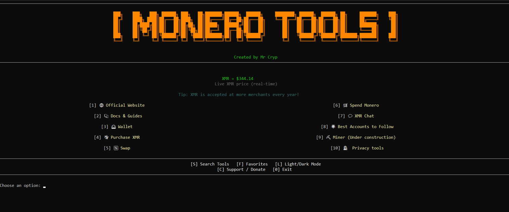

# Monero Tools Menu 🕵️‍♂️

A curated menu with the best Monero tools for privacy, wallets, VPNs, and more.  
**Created by [Mr Cryp](https://x.com/L0rd_t0ken)**


---

## Features

- Privacy browsers (Librewolf, Brave, Tor, Mullvad, etc.)
- Secure messaging, email, password managers, VPNs, and more
- Favorites and search system
- Dark/Light mode
- Live XMR price (via CoinGecko)

## Installation & Usage

1. **Clone the repository**
    ```bash
    git clone https://github.com/MrCrypPrivacy/Monero-Tools-Privacy.git
    cd Monero-Tools-Privacy
    ```

2. **Install dependencies**
    ```bash
    pip install requests
    ```

3. **Run the tool**
    ```bash
    python monero_tools.py
    ```
    *(Or on Linux/macOS, if you made it executable: `./monero_tools.py`)*

---

### Requirements

- Python 3.8 or higher
- The `requests` library

---

**Enjoy and stay private!**

## Support

Donate XMR:  
`87k6ViTfSFGApzyyqr8jsuELYeBQ37yvndCWJcHgHDUf97LUz36JUutBtJiBYNBBDJeBCPN8gf6jW9f3HgJKeMsbUx3VsB5`

BTC Silent Payments:  
`sp1qqg2s548t58g5x32jdhl33rxm8zy5r9aw3r7vrqfvrgjjz2c88dz96qc8qdge727xkd8umlwfr88gutqtu4dslrtkza0p6j0u44hwsgglmuky4xjj`

---

## License

MIT

---
**Created with ❤️ by Mr Cryp**
